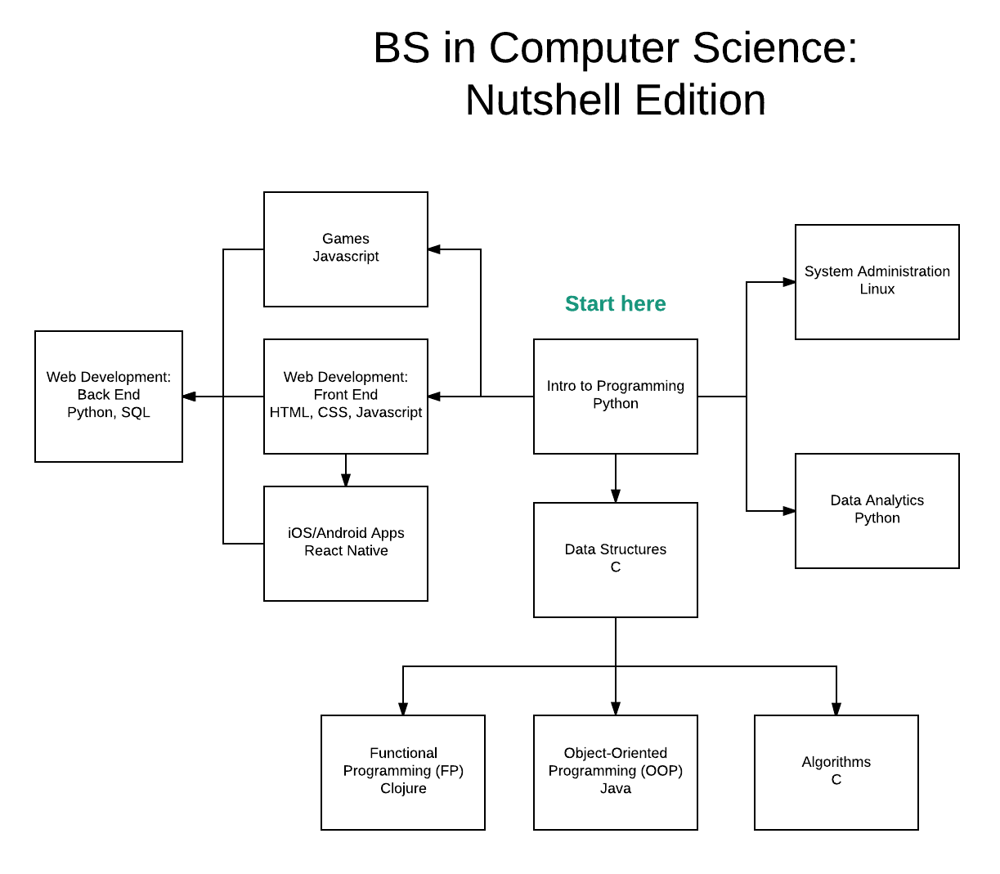

+++
shorttitle = "roadmap"
subsections = [ "overview" ]
subsections_weight = 7
+++

I have started writing the [Intro to Programming](../intro/intro/first-language) course
already. I'll get to the other courses later. [Here's
something](/ball.html) you'll learn to code up in the Games course,
for example. And here is a [short description](../games/ball) of it.

Coming soon: descriptions of all the different courses and examples of
programs you'll be able to write after taking them.
