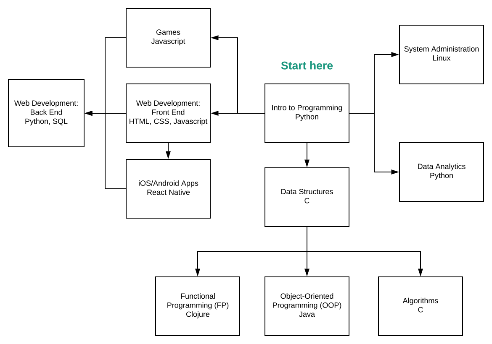

+++
name = "Programming (noun)"
+++

Definition: the chemical process by which pizza is converted to
software.

Many people would like to learn programming but don't know where to
start. Some people find a starting point (e.g. an introductory
computer science course in college) but have trouble learning the
material. My goal is to solve both problems. This website is meant to
be everything you need to become familiar with the
field of programming and get on track to becoming a skilled coder,
even if you're a complete beginner.

I've provided a roadmap below which describes different areas of
software development. You can think of the
different areas like courses you might take in a college computer
science program. For each course, I will provide:

 - a short description of the material
 - examples of software you will be able to create after learning the
   material
 - resources you can use to learn the material (e.g. links to online
   tutorials)
 - guidance on how to use the resources effectively

As time permits, I'll also add my own tutorials to this website.

If you already have ideas about what you want to learn, the roadmap
will show you how to get there. If you're just generally interested in
programming, the roadmap can show you where to start and give you some
ideas about what to try out next.

With time, you will reach the point where you don't need guidance from
people like me anymore; you'll be able to progress by coming up with
questions and doing the research to answer them on your own. This is
how experienced coders learn.

<!--
But let's take a step back. Why would you want to learn programming in
the first place? Here are a few possible reasons:

 - **It could turn into a lifelong passion.** Regardless of what you
   end up doing with it, programming is a
   [highly creative](http://www.paulgraham.com/hp.html) and
   satisfying discipline like music or painting.
 - **It can make a great career.** If you find out that you enjoy
   programming, you can do what you love and still be able to support
   a family.
 - **It's a great supplement to other careers.** It's handy to know
   how to throw together a website when you need one. Simple programs
   can help a lot with analyzing data from experimental research. Many
   boring, repetitive tasks can be automated with programming;
   learning how to program will help you see the opportunities to use
   it in your everyday life.
 - **It teaches you to think in a new way.** Programming makes you
   think logically, kind of like math. If you don't like math, you may
   find that programming is a fresh, enjoyable way to learn what math
   was supposed to teach you.

In short, programming has something to offer for everyone. I can't
think of anyone who wouldn't benefit from exposure to programming,
even if they decide not to pursue it.
-->

### Roadmap
(Click to enlarge)

### Course descriptions
(I've only written one course description so far. The rest will come
soon.)
